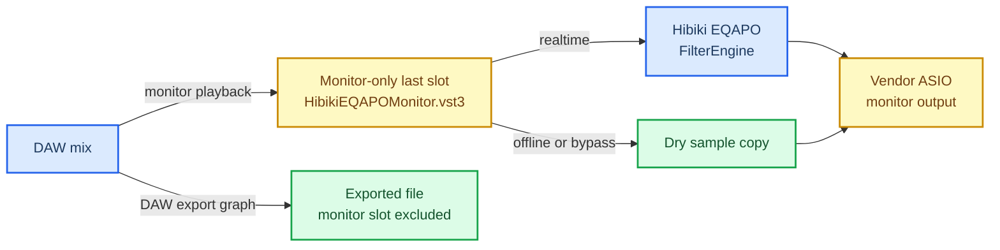

# Hibiki EQAPO Monitor VST3 工程與二進位分析報告

_分析日期：2026-09-06｜報告類型：授權本機 PE／VST3 工程驗證｜flavor：null_

> **快照說明：** 本檔保存 Monitor VST3 階段在 2026-09-06 當下的 artifact 與測試證據，不是 3.1.0 release-candidate 現況。後續 ASIO installer、最終測試數與安裝結果請以 [ASIO proxy 報告](2026-09-06_hibiki-eqapo-asio-proxy-report.md) 及根目錄 `HANDOFF.md` 為準。

> ⚠️ **必要使用邊界：** 本報告只描述進階 VST3 備援；預設、免逐專案插入的路徑是 [ADR-0007](decisions/0007-transparent-asio-proxy.md) 所定義的獨立 proxy driver。`HibikiEQAPOMonitor.vst3` 只應放在 DAW 明確保證不參與 export、bounce 與 freeze 的 **Monitor FX／Control Room／Listen Bus 最後一格**。它不是 ASIO driver 或 ASIO bridge，也不取代音訊介面的 vendor ASIO driver。real-time export 與可渲染的 master insert 沒有自動隔離保證，誤放時可能把監聽校正燒進輸出檔。

---

## 📋 摘要

這份報告記錄的可行結論是：保留 DAW 原本的 vendor ASIO driver，另外以 x64 VST3 monitor wrapper 在 DAW 的監聽路徑最後一段呼叫既有 `FilterEngine`，可作為特殊工作流的備援。它仍需由使用者在 DAW 建立 monitor-only insert，因此不再是產品的預設方案；免逐專案插入的主要方案由獨立 proxy driver 負責。

Release 建置、PE import、VST3 validator、direct／hardlink 自載防護、安裝管理器交易、Python 契約測試與原生 runtime 測試均已通過。本次產生的 module 為 5,146,112 bytes，SHA-256 為 `492676b1fc914f69ea73c660566942b6880b71085ede4ad73598d5675f1a4d95`；Release installer 為 16,108,197 bytes，SHA-256 為 `b04d0689b01c044f0d1c4f50415326de1ea69a2056d247f68eed5cb6c79ae3b9`。

本快照所記錄的階段仍不是可對外宣稱完成的正式二進位發行：主 NSIS 不部署 Monitor VST3、系統 VST3 目錄未安裝、未執行真實 DAW host matrix、未做簽章，也尚未完成靜態連結第三方元件的逐版本授權發行審核；當時工作樹亦尚未 commit、push、建立 tag 或發布。

## 🎯 範圍與授權

| 項目 | 本次範圍 |
| --- | --- |
| **Case** | `eqapo-monitor-vst3-final` |
| **授權** | 自有系統與本機 source repository，`auth.status = granted` |
| **網路模式** | `lab_only`；沒有對外部目標掃描或測試 |
| **主要目標** | x64 `HibikiEQAPOMonitor.vst3`、共用 `FilterEngine`、PE 依賴、self-load guard、獨立安裝管理器與 Release 驗證 |
| **不在範圍** | 未授權目標、真實使用者、阻斷服務、資料外傳、惡意程式或攻擊鏈分析 |
| **報告 flavor** | `null`；採一般工程／二進位分析結構，不套 malware、APT 或漏洞報告外殼 |

完整 scope、timeline、evidence graph 與 strict-review metadata 保留在本機忽略的 `work/eqapo-monitor-vst3-final/` evidence package；其中含機器特定資料，因此不納入 Git，也不從公開文件連向不存在於 repository 的路徑。

## 📚 架構與訊號路徑

下圖的主要安全邊界是 DAW 自己的 monitor-only routing。VST3 的 offline dry path 是第二層防護，不能替代正確路由。



正常播放時，DAW 完成 mix 後才進入 monitor-only VST3；wrapper 將相符 layout 的 32-bit 或 64-bit samples 交給 `FilterEngine`，再回到 vendor ASIO output。Host 在 `setupProcessing()` 宣告 offline 時，wrapper 不建立或保留 engine；只有個別 block 標成 offline 時，該 block 直接逐樣本複製乾聲，不在 audio callback 釋放既有 engine。

## 📚 實作決策

| 決策 | 作法 | 工程理由與後果 |
| --- | --- | --- |
| **保留 vendor ASIO** | 以 VST3 monitor effect 插在 DAW 內，不實作 ASIO driver／bridge | 不改變既有低延遲驅動與硬體 I/O ownership；功能只涵蓋進入此外掛的 DAW 訊號 |
| **重用 DSP 核心** | Wrapper 使用既有 `FilterEngine` 與 Hibiki EQAPO 設定 | 不維護第二份 EQ；任意設定鏈的即時性仍取決於其 filters |
| **Monitor-only 路由** | 要求放在不參與匯出的 Monitor FX／Control Room／Listen Bus 最後一格 | 匯出隔離由 DAW routing 提供；master insert 與 real-time export 不保證安全 |
| **Offline 乾聲** | Offline setup 釋放／略過 engine；offline block 僅 dry-copy | 避免一般 offline export 套用校正；無法辨識所有以 realtime mode 執行的匯出 |
| **合成裝置身分** | 固定 device string：`DAW Monitor Insert Hibiki EQAPO Monitor VST3` | 可用 `Device:` 將 monitor 設定與 Windows APO 設定分流，不偽裝成 Windows endpoint |
| **手動監聽音量** | `LoudnessCorrection:` 使用明確 `Volume` | ASIO 硬體旋鈕、介面 mixer/DSP 與類比衰減不會映射成 Windows endpoint volume |
| **靜態第三方音訊依賴** | FFTW、libsndfile 與 codec graph 使用 `x64-windows-static-md` | 避免 DAW process 中通用 DLL basename／ABI 碰撞；module 較大且增加授權發行義務 |
| **固定 Release payload** | Module 加四個 app-local VC runtime，共五個檔案 | Stage 與 manager 可驗證完整、封閉的 bundle 形狀 |
| **獨立安裝交易** | `manage-monitor-vst3.ps1` 以 manifest、hash、fixed slots 與 mutex 管理 | 不讓主 NSIS 跨到外部 VST3 tree；使用者必須明確安裝、更新與移除 |
| **實體檔案自載防護** | 以 volume serial 與 128-bit file ID 比對 module | 直接路徑、hardlink 與其他路徑別名不能遞迴載入自己或無界建立 out-of-process host |
| **Ready 條件** | 只有成功發布 active configuration 才保留 engine | 讀不到 `ConfigPath`／`config.txt` 或初始解析失敗時維持乾聲，而不是把 buffer 配置誤判為 ready |
| **Bypass 邊界** | Bypass 於 process-block 邊界生效 | 行為有界且不配置，但不是 sample-accurate automation |

## 📋 可行性、優點與缺點

| 面向 | 評估 |
| --- | --- |
| **整體可行性** | 可行，且 source、Release binary、staging 與獨立 manager 路徑已實作並通過本機工程驗證 |
| **低延遲路由** | 優點：DAW 繼續直接使用 vendor ASIO，不增加虛擬 driver 或 ASIO bridge 層 |
| **設定一致性** | 優點：沿用 Hibiki EQAPO `FilterEngine` 與同一份設定，不必在 DAW 重建校正曲線 |
| **匯出隔離** | 有條件優點：正確的 monitor-only slot 可天然排除 export graph，offline dry 再補一層防護 |
| **宿主相容性** | 優點：VST3 validator 的 32／64-bit sample、bus、state 與 bypass 測項通過；缺點：尚無真實 DAW matrix |
| **程序穩定性** | 缺點：`FilterEngine` 與設定中的第三方 VST 仍在 DAW process 內，deadline miss、hang 或 crash 可能直接影響 DAW |
| **延遲與 tail** | 缺點：任意 `Delay:`、`Convolution:`、`VSTPlugin:` 或 out-of-process command 的動態 latency／tail 不會回報 host |
| **硬體監聽** | 缺點：hardware direct monitor、介面內建 mixer/DSP 與類比輸出路徑完全繞過 wrapper |
| **部署維護** | 缺點：主 NSIS 不管理此外掛；安裝／更新／移除要關閉 DAW 並另跑 64-bit PowerShell manager |
| **發布成本** | 缺點：靜態依賴增加 binary、cache 與授權 notices／source／relink 材料審查工作 |

## ✍️ 建置、安裝與使用

### 建置與 staging

從 repository 根目錄執行：

```powershell
.\scripts\bootstrap-third-party.ps1
.\build-local-x64.ps1 -Configuration Release
.\scripts\stage-installer-x64.ps1 -Configuration Release
```

Release bundle 位於：

```text
build\VST3\Release\HibikiEQAPO\HibikiEQAPOMonitor.vst3
```

Staging 只用於 binary 與 payload 完整性檢查。**主 `Setup.nsi` 不會消費這個 VST3 subtree，也不會部署、更新、修復或移除系統 VST3 bundle。**

### 明確安裝與移除

先關閉所有 DAW，再以系統管理員身分開啟 **64-bit PowerShell**：

```powershell
.\scripts\manage-monitor-vst3.ps1 -Action Install -Configuration Release
```

預設安裝位置為：

```text
%CommonProgramFiles%\VST3\HibikiEQAPO\HibikiEQAPOMonitor.vst3
```

移除時同樣先關閉 DAW：

```powershell
.\scripts\manage-monitor-vst3.ps1 -Action Uninstall
```

本次分析沒有執行上述系統安裝，因此目前系統 VST3 目錄並未由本工作安裝此外掛。

### DAW 路由

1. 保持 DAW 使用音訊介面原本的 vendor ASIO driver。
2. 重新掃描 VST3，將 `Hibiki EQAPO Monitor` 放到 DAW 文件明確說明不參與 export／bounce／freeze 的 Monitor FX、Control Room 或 Listen Bus。
3. 將此外掛放在該監聽鏈的最後一格。
4. 不要放在一般 track、renderable bus 或 master insert。
5. 先以低音量測試 playback、bypass 與 routing，再開始正式監聽。

### Device scope 與響度設定

Wrapper 對 `FilterEngine` 提供固定的合成裝置字串。以下範例只讓 monitor wrapper 執行響度校正，然後恢復全域 scope：

```text
Device: DAW Monitor Insert Hibiki EQAPO Monitor VST3
LoudnessCorrection: Schema 1 Model FormulaLoudnessV1 Binding Single State 1 ReferenceLevel 80 ReferenceOffset 0 Attenuation 1.0 Volume -38.0
Device: all
```

`Volume -38.0` 只是範例，必須換成實際監聽音量。介面硬體旋鈕、內建 mixer/DSP 或類比 monitor gain 改變後，也必須同步更新 `Volume`。結尾的 `Device: all` 可避免後續命令意外留在 monitor scope；任何位於第一個 `Device:` 之前的未分流命令仍會在 wrapper 執行。

## 📋 證據 E-001 至 E-007

以下均為 2026-09-06 在授權本機 repository 的 Release 工作樹觀察；命令輸出沒有另存成不可變 log 時，`content_hash` 記為 `n/a`。

| ID | Source ref／類型 | 觀察結果 | Content hash | Repro command |
| --- | --- | --- | --- | --- |
| **E-001** | `scripts/build-installer-x64.ps1`、`Setup/Hibiki-EQAPO-x64-3.0.7.exe`／command + file | Release native、Qt、NSIS 建置完成，0 warnings、0 errors；installer 16,108,197 bytes | `b04d0689b01c044f0d1c4f50415326de1ea69a2056d247f68eed5cb6c79ae3b9` | `.\scripts\build-installer-x64.ps1 -Configuration Release` |
| **E-002** | `scripts/test-monitor-vst3-validator.ps1`／command | 官方 VST3 SDK 3.8.0 validator：537/537 通過，0 failed；factory、bus、state、float32／64 與 bypass 測項完成 | `n/a` | `.\scripts\test-monitor-vst3-validator.ps1 -Configuration Release` |
| **E-003** | `scripts/test-monitor-vst3-binary.ps1`、`HibikiEQAPOMonitor.vst3`／command + PE file | Module 5,146,112 bytes；AMD64 PE；normal imports 22、delay imports 0；未動態匯入受禁 FFTW／libsndfile／codec DLL | `492676b1fc914f69ea73c660566942b6880b71085ede4ad73598d5675f1a4d95` | `.\scripts\test-monitor-vst3-binary.ps1 -Configuration Release` |
| **E-004** | `scripts/test-vst-self-load-guard.ps1`／command | Direct `Benchmark.exe` 與 controlled hardlink 都在 in-process／out-of-process 建立前拒絕 recursive self-load，兩路皆 PASS | `n/a` | `.\scripts\test-vst-self-load-guard.ps1 -Configuration Release` |
| **E-005** | `tests/test_monitor_vst3_install.py`、manager temp root／command + files | Manager tests 9/9；Windows PowerShell 5.1 與 PowerShell 7 各 8/8 語法解析；真實 temp `DestinationRoot` install→manifest verify→uninstall roundtrip PASS | `n/a` | `python -B .\tests\test_monitor_vst3_install.py -v`；`.\scripts\manage-monitor-vst3.ps1 -Action Install -Configuration Release -DestinationRoot <temp>` |
| **E-006** | `tests/`、`scripts/test-runtime-loudness.ps1`／command | Python 共執行 381 項：380 通過、1 項預期 skip；skip 原因為目前權限無法建立 Global mapping，Win32 error 5。HybridConv、DSP 數值防護、FilterEngine reload／handoff 與 loudness runtime 全 PASS | `n/a` | `python -B -m unittest discover -s .\tests -p "test_*.py" -v`；`.\scripts\test-runtime-loudness.ps1 -Configuration Release` |
| **E-007** | Release source/stage bundle／command + files | Source 與 stage 都精確包含五個 payload、三個目錄、零 reparse point；逐檔 length 與 SHA-256 完全一致 | `492676b1fc914f69ea73c660566942b6880b71085ede4ad73598d5675f1a4d95`（主模組） | `.\scripts\stage-installer-x64.ps1 -Configuration Release`；比較兩個 `Contents\x86_64-win` 目錄的 `Get-FileHash` 結果 |

Stage 的五個 Release payload 為：

| 檔案 | 角色 |
| --- | --- |
| **`HibikiEQAPOMonitor.vst3`** | AMD64 VST3 module |
| **`msvcp140.dll`** | App-local Microsoft C++ runtime |
| **`msvcp140_1.dll`** | App-local Microsoft C++ runtime |
| **`vcruntime140.dll`** | App-local Microsoft VC runtime |
| **`vcruntime140_1.dll`** | App-local Microsoft VC runtime |

安裝後 manager 另建立 `Contents\Resources\hibiki-eqapo-monitor.json` ownership manifest；manifest 是安裝交易狀態，不屬於五個 build/staging payload。

### 完整可重現命令

```powershell
.\scripts\build-installer-x64.ps1 -Configuration Release
.\scripts\test-runtime-loudness.ps1 -Configuration Release
.\scripts\test-monitor-vst3-binary.ps1 -Configuration Release
.\scripts\test-vst-self-load-guard.ps1 -Configuration Release
.\scripts\test-monitor-vst3-validator.ps1 -Configuration Release
.\scripts\stage-installer-x64.ps1 -Configuration Release
python -B -m unittest discover -s .\tests -p "test_monitor_vst3_install.py" -v
python -B -m unittest discover -s .\tests -p "test_*.py" -v
```

用全新 temp destination 重現 manager 的實際 bundle 交易：

```powershell
$validationRoot = Join-Path `
    ([System.IO.Path]::GetTempPath()) `
    ("HibikiEQAPOMonitorVST3-" + [guid]::NewGuid().ToString("N"))
New-Item -ItemType Directory -Path $validationRoot | Out-Null
.\scripts\manage-monitor-vst3.ps1 `
    -Action Install `
    -Configuration Release `
    -DestinationRoot $validationRoot
.\scripts\manage-monitor-vst3.ps1 `
    -Action Uninstall `
    -Configuration Release `
    -DestinationRoot $validationRoot
```

上述 roundtrip 只操作新建的專用 temp root，不代表系統 `%CommonProgramFiles%\VST3` 已安裝。

## 📋 Findings 與 Path

### Findings

| ID | Severity／category／status | Evidence | Confidence | Location | 結論與影響 |
| --- | --- | --- | --- | --- | --- |
| **F-001** | `info`／`design`／`validated` | E-001、E-002、E-003、E-007 | High | `MonitorVST3/`、`FilterEngine.*` | Vendor ASIO + monitor-only VST3 + `FilterEngine` 的實作路徑可建置且通過 host contract；這不等於 ASIO driver 支援 |
| **F-002** | `info`／`design`／`validated` | E-003、E-007 | High | `MonitorVST3.vcxproj`、`MonitorVST3Binary.psm1` | 音訊第三方相依已靜態連結，PE normal／delay imports 沒有受禁通用 codec DLL，降低同程序 DLL basename／ABI 碰撞面 |
| **F-003** | `low`／`design`／`validated` | E-004、E-006 | High | `VSTPluginLibrary.*`、self-load harness | 實體檔案身分 guard 對 direct path 與 hardlink 有效，可阻止 monitor module 遞迴自載與無界 out-of-process host 鏈 |
| **F-004** | `low`／`design`／`validated` | E-003、E-005、E-007 | High | `manage-monitor-vst3.ps1` | 固定 bundle 形狀、ownership manifest、hash 與 transaction slots 可支援可驗證的獨立 install／update／uninstall；主 NSIS 刻意不取得此外部 tree ownership |
| **F-005** | `medium`／`design`／`accepted_risk` | E-002、E-006 | High | `MonitorVST3Processor.cpp`、`docs/decisions/0006-monitor-vst3.md` | Export 隔離仍取決於 DAW monitor routing；master insert 或 real-time export 可能包含校正，且目前沒有真實 DAW matrix 證據可提升為正式發行狀態 |
| **F-006** | `info`／`design`／`validated` | E-001、E-002、E-006 | High | `MonitorVST3Processor.cpp`、`FilterEngine.cpp` | 設定不可用時 wrapper 維持乾聲；舊 configuration 由 audio callback 原子發布後在 notification worker 回收，不在 callback 釋放 semaphore |

### P-001：DAW 監聽校正 callflow

- **path_type:** `callflow`
- **start:** DAW 已完成的 mix signal
- **goal:** 保留 vendor ASIO，僅在監聽輸出套用 Hibiki EQAPO 校正

| Step | Action | Evidence | Finding |
| ---: | --- | --- | --- |
| 1 | DAW 將 playback signal 送到不參與 export 的 monitor-only last slot | E-001、E-002 | F-001、F-005 |
| 2 | `HibikiEQAPOMonitor.vst3` 依 process mode、layout、bypass 與 engine readiness 決定 realtime 或 dry path | E-002、E-006 | F-001、F-006 |
| 3 | Realtime path 以合成 device identity 載入目前 Hibiki EQAPO configuration，交給 `FilterEngine` | E-001、E-006 | F-001、F-006 |
| 4 | `FilterEngine` 處理後將 monitor samples 交回 DAW，再由原本的 vendor ASIO driver 輸出 | E-001、E-002 | F-001 |
| 5 | Offline 或 bypass path 逐樣本 dry-copy；DAW export graph 應在進入 monitor slot 前分流 | E-002、E-006 | F-005、F-006 |

- **residual_risks:** DAW 以 realtime mode 執行 export、使用者誤放 master insert、第三方 filter deadline／crash、hardware direct monitoring 繞過，以及未回報動態 latency／tail。

### P-002：Release payload 安裝與 export 邊界 callflow

- **path_type:** `callflow`
- **start:** 已建置的 Release 五檔 bundle
- **goal:** 只安裝經 PE 稽核且由 manifest 擁有的 bundle，並維持 monitor-only export 邊界

| Step | Action | Evidence | Finding |
| ---: | --- | --- | --- |
| 1 | Source 與 staging 的五檔 payload 先以 exact-set、length、SHA-256 與 reparse gate 比對 | E-003、E-007 | F-002、F-004 |
| 2 | Manager 對 source、transaction staging 與 final destination 逐次驗證 AMD64 PE32+ 及 normal／delay imports | E-003、E-005 | F-002、F-004 |
| 3 | 安裝後以 ownership manifest 約束更新與移除；額外檔案、竄改或 reparse point 失效安全地拒絕 | E-005、E-007 | F-004 |
| 4 | Host 明確標示 offline 時走 dry path；以 realtime export 時仍由 DAW routing 決定是否包含校正 | E-002、E-006 | F-005、F-006 |

## ⚠️ 限制、未驗證項與發行狀態

### 已知 residual risks

- **Block-rate bypass：** Bypass 只在 process-block 邊界更新，不是 sample-accurate automation。
- **無動態 latency／tail：** 任意 `Delay:`、`Convolution:`、`VSTPlugin:` 與 out-of-process command 的延遲或 tail 不會動態回報 DAW。
- **第三方程式碼風險：** 第三方 VST、out-of-process 設定或其他 filter 可能 deadline miss、hang 或 crash；wrapper 在 DAW process 內，無法把所有故障隔離在外。
- **硬體路徑繞過：** Audio interface hardware direct monitor、內建 mixer/DSP 與類比音量路徑不經過 VST3，校正與手動 `Volume` 也無法自動追蹤它們。
- **實體身分 slot 保留：** Shared VST runtime 會為每個曾見過的唯一 physical file identity 保留一個很小的 process-lifetime slot；長時間掃描大量獨立外掛時，這是有界單項但會隨唯一檔案數累積的 metadata 成本。
- **Monitor routing 條件：** VST3 沒有跨 DAW 通用的「永遠不參與匯出」類別。只有 DAW 文件明確排除 export 的 monitor-only slot 才是主要邊界。

### 尚未完成或刻意未執行

- 未在 Cubase Control Room、REAPER Monitor FX、Studio One Listen Bus 或其他真實 DAW 跑完整 scan、playback、session restore、automation、不同 buffer size、unload 與長時壓力 matrix。
- 未用真實 DAW 同時驗證 offline export 無校正，以及 real-time export／master insert 可能包含校正的警語情境。
- 主 NSIS **不部署** Monitor VST3；staged subtree 只供 integrity gate。
- 本次只在專用 temp destination 驗證 manager，**系統 VST3 目錄未安裝**。
- Release installer 與 VST3 module **未簽章**。
- 靜態連結第三方元件的 notices、對應 source／relink material 與逐版本再散布條件 **尚未完成正式授權發行審核**；本報告不是法律意見。
- 在本快照建立當下，變更 **尚未 commit、push、建立 tag、建立 PR 或發布 release**；後續 Git 狀態應以即時 repository 與 `HANDOFF.md` 為準。
- Python 唯一 expected skip 是需要建立 `Global\` named mapping 的 host handoff case；目前環境回傳 Win32 error 5，其餘 380 項通過不能取代該權限情境的實跑。

因此，本報告支持的結論是「方案具工程可行性，Release artifact 與主要安全 gate 已在本機通過」；不支持「已通過所有 DAW」、「任何 insert 都不會被匯出」或「已可直接作為簽章正式發行版」等宣稱。
